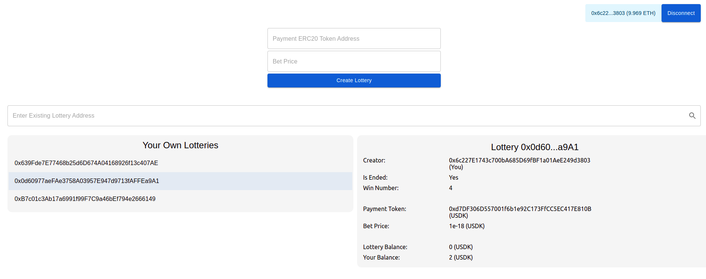

# Lottery Contracts

## Introduction

Lottery is a game that player can bet a under-100 number X. Player must pay erc20 token to bet. When game owner stop the game, we use block number B to calculate win number W = B % 100. If X = W, then player win. Game owner get 10% of the money, all the winners will get the rest of money from contract.

## Demo Application

<http://tiki-lottery-dapp.s3-website-ap-southeast-1.amazonaws.com/>

- Contracts are deployed on Ropsten testnet
- Factory contract: 0x7FffF4f92E1dB6B32f337affE2Ae6a7c244699C3

## How to use

You can `Create new` lottery or `Use existing` lottery.

With existing lottery contract, you can `enter address` (e.g. 0x0f12f75Af1702E958061d73B511EE475e0cF64aF) or a lottery, or `pick` from the list (left side) of lotteries you created before.

To interact with a lottery (right side):

- If you are creator, you can stop the lottery
- If you are not creator, you can bet
  1. Approve lottery contract to use token (you must own enough token)
  2. Enter the number you guess, click Bet
